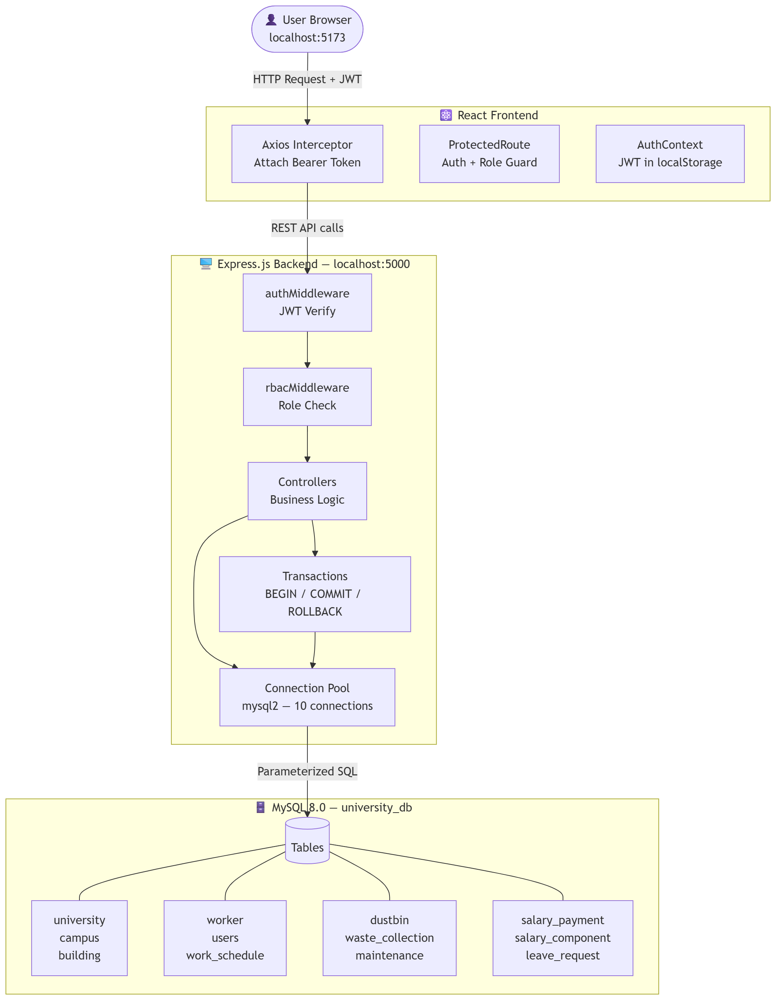
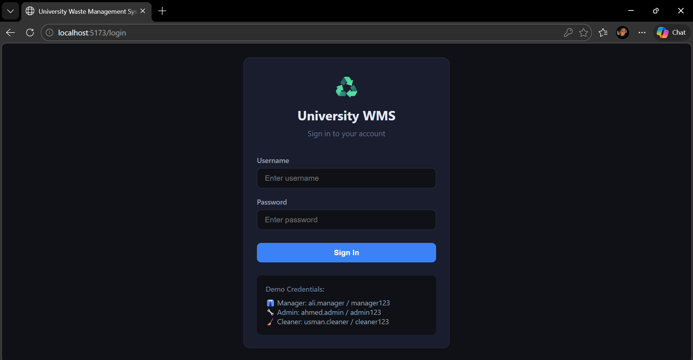
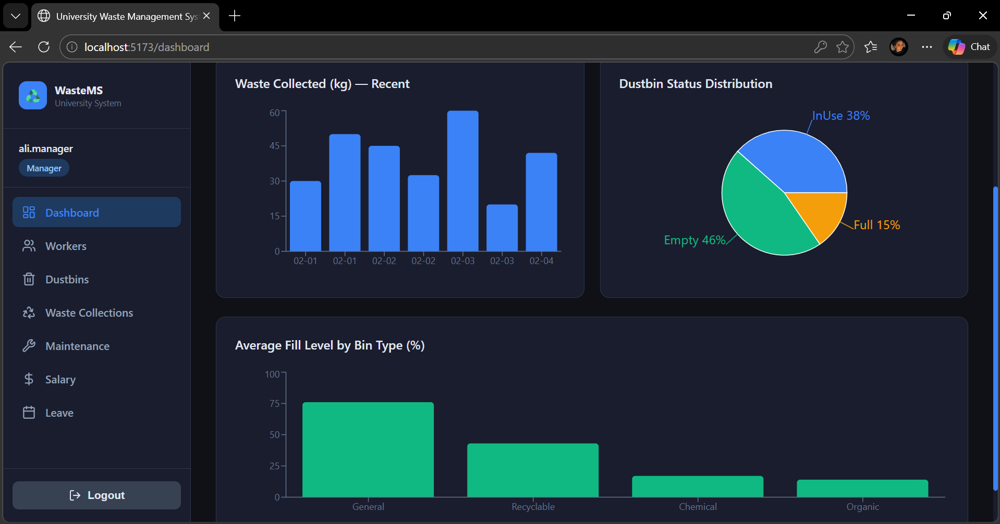
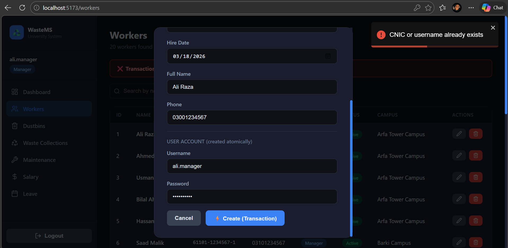

# ♻️ University Waste Management System

A full-stack web application to digitize and streamline waste management operations across university campuses. Replaces manual paper-based tracking of dustbin status, waste collections, worker assignments, maintenance requests, salary processing, and leave management.

---

## 👥 Team Members

| Name | Role |
|------|------|
| Momina Qayyum | Backend API + Database Design + Documentation |
| Hoorain Tahir | Frontend + UI/UX + Transactions |

---

## 🧰 Tech Stack

### Frontend
| Technology | Purpose |
|------------|---------|
| React.js 18 + Vite 5 | UI framework + build tool |
| React Router DOM 6 | Client-side routing + protected routes |
| Axios | HTTP client with JWT interceptor |
| Recharts | Charts and data visualizations |
| React Toastify | Toast notifications |
| Lucide React | Icon library |

### Backend
| Technology | Purpose |
|------------|---------|
| Node.js 18 + Express.js | REST API server |
| mysql2/promise | MySQL driver with async/await |
| bcryptjs | Password hashing (salt rounds = 10) |
| jsonwebtoken | JWT token generation and verification |
| helmet + cors | HTTP security headers + CORS |
| express-rate-limit | 100 req / 15 min rate limiting |
| swagger-ui-express | Live API documentation at /api/docs |
| dotenv | Environment variable management |

### Database & Auth
| Technology | Purpose |
|------------|---------|
| MySQL 8.0 InnoDB | Relational database — ACID compliant |
| JWT (JSON Web Tokens) | Stateless authentication |
| bcryptjs | Password hashing — never stored in plaintext |

---

## 🗂️ Project Structure
```
Project01/
│
├── backend/
│   ├── config/
│   │   └── db.js                  # MySQL connection pool (10 connections)
│   ├── controllers/
│   │   ├── authController.js      # Login + register logic
│   │   ├── workerController.js    # Worker CRUD + Transaction 1
│   │   └── wasteController.js     # Dustbins, waste, maintenance, salary, leave
│   ├── middleware/
│   │   ├── authMiddleware.js      # JWT verification on every request
│   │   └── rbacMiddleware.js      # Role-based access control
│   ├── routes/
│   │   ├── authRoutes.js          # /api/v1/auth/*
│   │   ├── workerRoutes.js        # /api/v1/workers/*
│   │   └── wasteRoutes.js         # All other domain routes
│   ├── transactions/
│   │   └── wasteTransaction.js    # Transaction 2 and 3 — BEGIN/COMMIT/ROLLBACK
│   ├── swagger/
│   │   └── swagger.yaml           # Full OpenAPI 3.0 specification
│   ├── server.js                  # Express app entry point
│   ├── .env.example
│   └── package.json
│
├── frontend/
│   ├── api/
│   │   └── axios.js               # Axios instance + JWT interceptor
│   ├── components/
│   │   ├── Sidebar.jsx            # Role-aware navigation sidebar
│   │   └── Layout.jsx             # Page wrapper with sidebar
│   ├── context/
│   │   └── AuthContext.jsx        # Global JWT + user state
│   ├── pages/
│   │   ├── auth/                  # Login.jsx, Register.jsx
│   │   ├── dashboard/             # Dashboard.jsx — charts + stats
│   │   ├── workers/               # Workers.jsx — CRUD + transaction demo
│   │   ├── dustbins/              # Dustbins.jsx — CRUD + fill level bars
│   │   ├── waste/                 # Waste.jsx — collection recording
│   │   ├── maintenance/           # Maintenance.jsx — request management
│   │   ├── salary/                # Salary.jsx — payment processing
│   │   └── leave/                 # Leave.jsx — request + approval
│   ├── utils/
│   │   └── ProtectedRoute.jsx     # Redirects if no token or wrong role
│   ├── App.jsx                    # Route definitions
│   ├── main.jsx                   # React entry point
│   ├── index.css                  # Global dark theme styles
│   ├── index.html
│   ├── vite.config.js
│   ├── .env.example
│   └── package.json
│
├── schema.sql                     # Database schema including users table
├── seed.sql                       # Sample data + 3 default user accounts
├── performance.sql                # Index benchmarks with EXPLAIN ANALYZE
└── README.md
```

---

## 🏗️ System Architecture

The system follows a 3-tier architecture:

**Frontend (React)** communicates exclusively with the **Backend (Express.js)** via REST API calls over HTTP. The frontend never touches the database directly. Every request carries a JWT Bearer token which is verified by the backend before any data is returned. The **Backend** connects to **MySQL** through a connection pool of 10 reusable connections, executing raw parameterized SQL queries — no ORM is used for critical operations.
```
Browser (React :5173)
        │
        │  HTTP + Authorization: Bearer <JWT>
        ▼
Express.js API (:5000)
        │
        ├── authMiddleware → verify JWT
        ├── rbacMiddleware → check role
        ├── Controllers → business logic
        └── Transactions → BEGIN/COMMIT/ROLLBACK
        │
        │  Parameterized SQL
        ▼
MySQL 8.0 (university_db)
        │
        ├── university → campus → building → dustbin
        ├── worker → waste_collection / maintenance_request
        ├── worker → salary_payment → salary_component
        └── worker → leave_request / users
```


.png)
.png)

---

## 📸 UI Examples

### 1. Login Page


The login page is the entry point for all users. It submits credentials to `POST /api/v1/auth/login`. The backend verifies the password using bcrypt and returns a JWT token on success. The token is stored in `localStorage` and attached to all future requests via Axios interceptor. Unauthenticated users are automatically redirected here by `ProtectedRoute.jsx`. This page is required because it is the gateway to the entire system and demonstrates JWT-based authentication.

### 2. Analytics Dashboard


The dashboard is the first page after login — accessible by all roles. It fetches live data from 4 endpoints in parallel and displays 4 stat cards (workers, dustbins, collections, maintenance), a bar chart of recent waste collected in kg, a pie chart of dustbin status distribution, and a bar chart of average fill level by bin type using Recharts. This page satisfies **Complex Feature 1 — Analytics Dashboard with visualizations**.

### 3. Transaction Rollback Demo


The Workers page demonstrates a visible atomic operation. When a Manager submits the Create Worker form with a duplicate CNIC, the backend runs a transaction that inserts into both `worker` and `users` tables. The duplicate triggers a rollback and the frontend displays a red banner: **"Transaction Rolled Back — CNIC or username already exists"**. This page is required to demonstrate **Transaction Management** with visible success/failure feedback as required by the rubric.

---

## ⚙️ Setup & Installation

### Prerequisites

| Requirement | Version |
|-------------|---------|
| Node.js | v18+ |
| npm | v9+ |
| MySQL | 8.0+ |
| MySQL Workbench | 8.0+ (recommended) |

### Step 1 — Database Initialization

Open MySQL Workbench and run the following in exact order:
```sql
-- Run schema.sql first (File → Open SQL Script → schema.sql → Ctrl+Shift+Enter)
-- Then disable safe updates
SET SQL_SAFE_UPDATES = 0;
-- Run seed.sql (File → Open SQL Script → seed.sql → Ctrl+Shift+Enter)
-- Re-enable safe updates
SET SQL_SAFE_UPDATES = 1;
```

Verify successful import:
```sql
USE university_db;
SELECT 'workers'  AS table_name, COUNT(*) AS count FROM worker
UNION ALL SELECT 'dustbins',  COUNT(*) FROM dustbin
UNION ALL SELECT 'users',     COUNT(*) FROM users;
-- Expected: workers=20, dustbins=28, users=3
```

### Step 2 — Backend Installation & Configuration
```bash
# Navigate to backend
cd backend

# Copy environment file
cp .env.example .env

# Open .env and set your MySQL password
# (see Environment Variables section below)

# Install all dependencies
npm install

# Start development server
npm run dev
```

Expected output:
```
Server running on http://localhost:5000
Swagger docs at http://localhost:5000/api/docs
MySQL connection pool established
```

### Step 3 — Frontend Installation & Configuration
```bash
# Open a NEW terminal window (keep backend running)

# Navigate to frontend
cd frontend

# Copy environment file
cp .env.example .env

# Install all dependencies
npm install

# Start development server
npm run dev
```

Expected output:
```
VITE v5.x.x  ready in xxxms
➜  Local:   http://localhost:5173/
```

### Step 4 — Open in Browser
```
http://localhost:5173
```

Login with any of the credentials listed in the User Roles section below.

---

## 🔐 Environment Variables

### `backend/.env`
```env
PORT=5000
DB_HOST=localhost
DB_USER=root
DB_PASSWORD=your_mysql_password_here
DB_NAME=university_db
JWT_SECRET=any_long_random_string_keep_this_private
JWT_EXPIRES_IN=24h
```

| Variable | Required | Description | Example |
|----------|----------|-------------|---------|
| `PORT` | Yes | Port the backend runs on | `5000` |
| `DB_HOST` | Yes | MySQL server hostname | `localhost` |
| `DB_USER` | Yes | MySQL username | `root` |
| `DB_PASSWORD` | Yes | Your MySQL password | `mypassword123` |
| `DB_NAME` | Yes | Database name — do not change | `university_db` |
| `JWT_SECRET` | Yes | Secret key for signing tokens — keep private, min 32 chars | `supersecretkey123456789` |
| `JWT_EXPIRES_IN` | Yes | How long tokens stay valid | `24h` |

### `frontend/.env`
```env
VITE_API_URL=http://localhost:5000/api/v1
```

| Variable | Required | Description | Example |
|----------|----------|-------------|---------|
| `VITE_API_URL` | Yes | Full base URL of the backend API | `http://localhost:5000/api/v1` |

---

## 👤 User Roles & Credentials

### Default Login Credentials (from seed.sql)

| Role | Username | Password | Access Level |
|------|----------|----------|--------------|
| **Manager** | `ali.manager` | `manager123` | Full access to all features |
| **Admin** | `ahmed.admin` | `admin123` | Operations management — no salary/delete |
| **Cleaner** | `usman.cleaner` | `cleaner123` | Limited — record waste, submit requests |

### Permissions Matrix

| Feature | Manager | Admin | Cleaner |
|---------|:-------:|:-----:|:-------:|
| Login / Logout | ✅ | ✅ | ✅ |
| View Dashboard + Charts | ✅ | ✅ | ✅ |
| Register new system users | ✅ | ❌ | ❌ |
| View and search workers | ✅ | ✅ | ❌ |
| Create worker (transaction) | ✅ | ❌ | ❌ |
| Edit worker details | ✅ | ✅ | ❌ |
| Delete worker | ✅ | ❌ | ❌ |
| View all dustbins | ✅ | ✅ | ✅ |
| Add / edit dustbin | ✅ | ✅ | ❌ |
| Record waste collection (transaction) | ✅ | ✅ | ✅ |
| Submit maintenance request | ✅ | ✅ | ✅ |
| Update maintenance status | ✅ | ✅ | ❌ |
| View salary records | ✅ | ❌ | ❌ |
| Process salary payment (transaction) | ✅ | ❌ | ❌ |
| Submit leave request | ✅ | ✅ | ✅ |
| Approve or reject leave | ✅ | ❌ | ❌ |

---

## 🚀 Feature Walkthrough

### Authentication
- **What it does:** Login issues a JWT token. Logout clears the token. Register creates new staff accounts.
- **Role access:** Login/Logout — all roles. Register — Manager only.
- **Pages:** `/login`, `/register`
- **Endpoints:** `POST /api/v1/auth/login`, `POST /api/v1/auth/register`

### Analytics Dashboard
- **What it does:** Displays live stats (worker count, dustbin count, collections, maintenance) and 3 charts — waste collected over time, dustbin status pie chart, fill level by bin type.
- **Role access:** All roles.
- **Page:** `/dashboard`
- **Endpoints:** `GET /dustbins`, `GET /workers`, `GET /waste-collections`, `GET /maintenance`
- **Complex Feature:** Analytics Dashboard with Recharts visualizations.

### Workers Management
- **What it does:** Full CRUD for worker records. Create Worker is a transaction that atomically creates a worker record AND a login account. Search by name/CNIC, filter by type.
- **Role access:** View — Manager, Admin. Create/Delete — Manager only.
- **Page:** `/workers`
- **Endpoints:** `GET/POST/PUT/DELETE /api/v1/workers`
- **Complex Feature:** Advanced search and filtering.

### Dustbins Management
- **What it does:** Lists all dustbins with visual fill level progress bars (green/yellow/red). Red alert banner when any bin is ≥80% full. Search by building/campus, filter by status.
- **Role access:** View — all roles. Add/Edit — Manager, Admin.
- **Page:** `/dustbins`
- **Endpoints:** `GET /api/v1/dustbins`, `GET /api/v1/dustbins/full`, `POST/PUT /api/v1/dustbins`

### Waste Collections
- **What it does:** Records waste collection events. Submitting a collection is a transaction that inserts the record AND resets the dustbin fill level to 0 atomically. Shows transaction result banner.
- **Role access:** All roles.
- **Page:** `/waste`
- **Endpoints:** `GET/POST /api/v1/waste-collections`, `GET /api/v1/waste-collections/report`

### Maintenance Requests
- **What it does:** Any worker can submit a maintenance request for a broken dustbin. Manager/Admin can update status from Pending → InProgress → Resolved. Filter by status.
- **Role access:** Submit — all roles. Update status — Manager, Admin.
- **Page:** `/maintenance`
- **Endpoints:** `GET/POST /api/v1/maintenance`, `PUT /api/v1/maintenance/:id`

### Salary Management
- **What it does:** Processes salary payments for workers. Each payment is a transaction that creates a payment header + all salary components (Basic, Bonus, Deduction) atomically. Prevents duplicate payments for the same month/year.
- **Role access:** Manager only — hidden from other roles entirely.
- **Page:** `/salary`
- **Endpoints:** `GET/POST /api/v1/salary`, `GET /api/v1/salary/worker/:id`

### Leave Management
- **What it does:** Workers submit leave requests (Casual/Sick/Annual). Manager can approve or reject pending requests. Client-side validation prevents end date before start date.
- **Role access:** Submit — all roles. Approve/Reject — Manager only.
- **Page:** `/leave`
- **Endpoints:** `GET/POST /api/v1/leave`, `PUT /api/v1/leave/:id/approve`

---

## ⚡ Transaction Scenarios

### Transaction 1 — Create Worker + User Account
| Field | Detail |
|-------|--------|
| **Trigger** | Manager submits the Create Worker form on `/workers` |
| **Endpoint** | `POST /api/v1/workers` |
| **Code file** | `backend/controllers/workerController.js` → `createWorker()` |
| **Atomic operations** | 1. INSERT into `worker` table, 2. bcrypt.hash(password), 3. INSERT into `users` table |
| **COMMIT when** | Both inserts succeed |
| **ROLLBACK when** | Duplicate CNIC (ER_DUP_ENTRY on worker) OR duplicate username (ER_DUP_ENTRY on users) |
| **UI feedback** | ✅ Green: "Transaction committed — Worker ID: X created atomically" / ❌ Red: "Transaction rolled back — Duplicate entry" |

### Transaction 2 — Record Waste Collection + Reset Dustbin Fill Level
| Field | Detail |
|-------|--------|
| **Trigger** | Any user submits the Record Collection form on `/waste` |
| **Endpoint** | `POST /api/v1/waste-collections` |
| **Code file** | `backend/transactions/wasteTransaction.js` → `recordWasteCollection()` |
| **Atomic operations** | 1. Verify dustbin exists, 2. INSERT into `waste_collection`, 3. UPDATE `dustbin` SET current_fill_level=0 |
| **COMMIT when** | Both insert and update succeed |
| **ROLLBACK when** | Dustbin ID not found, invalid worker_id FK violation, or any DB error |
| **UI feedback** | ✅ Green: "Collection ID: X. Dustbin fill level atomically reset to 0%" / ❌ Red: rollback reason |

### Transaction 3 — Process Salary Payment + All Components
| Field | Detail |
|-------|--------|
| **Trigger** | Manager submits Process Salary form on `/salary` |
| **Endpoint** | `POST /api/v1/salary` |
| **Code file** | `backend/transactions/wasteTransaction.js` → `processSalaryPayment()` |
| **Atomic operations** | 1. Check for duplicate (worker/month/year), 2. INSERT into `salary_payment`, 3. INSERT each row into `salary_component` |
| **COMMIT when** | Payment header and all components inserted successfully |
| **ROLLBACK when** | Duplicate payment detected, missing component fields, or any INSERT failure |
| **UI feedback** | ✅ Green: "Payment ID: X. X components inserted atomically" / ❌ Red: "Salary already processed for this month/year" |

---

## 🔒 ACID Compliance

| Property | Implementation in codebase |
|----------|---------------------------|
| **Atomicity** | All 3 critical operations use explicit `conn.beginTransaction()` → `conn.commit()` → `conn.rollback()` in `workerController.js` and `wasteTransaction.js`. If any step throws, the catch block calls `conn.rollback()` before re-throwing. |
| **Consistency** | Database-level constraints enforce valid state at all times: `CHECK (current_fill_level BETWEEN 0 AND 100)`, `CHECK (capacity >= 0)`, `CHECK (month BETWEEN 1 AND 12)`, `UNIQUE` on `CNIC` and `username`, `FOREIGN KEY` on all relationships, and trigger `trg_leave_validate` rejects leave requests where end date is before start date. |
| **Isolation** | MySQL InnoDB default isolation level is REPEATABLE READ. Each transaction calls `pool.getConnection()` to obtain a **dedicated connection** that is not shared with other requests during the transaction. The connection is held exclusively until `COMMIT` or `ROLLBACK`, then released via `conn.release()` in the `finally` block. |
| **Durability** | MySQL InnoDB writes committed data to disk via its redo log before acknowledging the `COMMIT`. The connection pool is configured with `waitForConnections: true` ensuring no requests are dropped. All worker records, waste collections, and salary payments persist permanently after `COMMIT`. |

---

## 📊 Indexing & Performance

The following indexes were created in `performance.sql`. Each was benchmarked using `EXPLAIN ANALYZE` before and after creation.

| Index | Table | Column(s) | Why added |
|-------|-------|-----------|-----------|
| `idx_campus_university` | campus | university_id | Speed up campus lookups per university |
| `idx_building_campus` | building | campus_id | Speed up building joins per campus |
| `idx_worker_campus` | worker | campus_id | Filter workers by campus |
| `idx_dustbin_building` | dustbin | building_id | Join dustbins to buildings efficiently |
| `idx_wc_dustbin_date` | waste_collection | dustbin_id, collection_date | Composite index for date-range reports per dustbin |
| `idx_mr_status` | maintenance_request | maintenance_status_id | Dashboard query for pending requests |
| `idx_salary_worker_date` | salary_payment | worker_id, year, month | Monthly salary lookup per worker |
| `idx_ws_worker_date` | work_schedule | worker_id, shift_date | Schedule queries by worker and date |
| `idx_leave_worker` | leave_request | worker_id | Leave history per worker |

### Before vs After Performance (from performance.sql EXPLAIN ANALYZE)

| Query | Without Index | With Index | Result |
|-------|--------------|------------|--------|
| Waste collection report (dustbin_id + date range) | Full table scan — rows=10, no key used | Index range scan on `idx_wc_dustbin_date` | Eliminates full scan — uses composite key directly |
| Monthly salary lookup (worker_id + year) | Full table scan — scans all payments | Index lookup on `idx_salary_worker_date` | Direct access to worker's records only |
| Worker schedule (worker_id + date range) | Full table scan — all schedules scanned | Range scan on `idx_ws_worker_date` | Scans only matching worker's rows |
| Pending maintenance dashboard | Full table scan on status join | Index lookup on `idx_mr_status` | Instant status-based filtering |

---

## 📡 API Reference

Full interactive spec: `http://localhost:5000/api/docs` (Swagger UI)
Spec file: `backend/swagger/swagger.yaml`

| Method | Route | Auth Required | Role | Purpose |
|--------|-------|:-------------:|------|---------|
| POST | `/auth/login` | ❌ | Public | Login and receive JWT token |
| POST | `/auth/register` | ✅ | Manager | Register new system user |
| GET | `/workers` | ✅ | Manager, Admin | List all workers |
| POST | `/workers` | ✅ | Manager | Create worker + user account (transaction) |
| GET | `/workers/:id` | ✅ | Manager, Admin | Get single worker |
| PUT | `/workers/:id` | ✅ | Manager, Admin | Update worker details |
| DELETE | `/workers/:id` | ✅ | Manager | Delete worker |
| GET | `/dustbins` | ✅ | All | List all dustbins |
| GET | `/dustbins/full` | ✅ | All | Dustbins at or above 80% fill |
| POST | `/dustbins` | ✅ | Manager, Admin | Add new dustbin |
| PUT | `/dustbins/:id` | ✅ | Manager, Admin | Update dustbin fill/status |
| GET | `/waste-collections` | ✅ | All | List all waste collections |
| POST | `/waste-collections` | ✅ | All | Record collection + reset dustbin (transaction) |
| GET | `/waste-collections/report` | ✅ | Manager, Admin | Date-range report by dustbin |
| GET | `/maintenance` | ✅ | Manager, Admin | List all maintenance requests |
| GET | `/maintenance/pending` | ✅ | All | Pending and in-progress requests |
| POST | `/maintenance` | ✅ | All | Submit maintenance request |
| PUT | `/maintenance/:id` | ✅ | Manager, Admin | Update maintenance status |
| GET | `/salary` | ✅ | Manager | List all salary payments |
| POST | `/salary` | ✅ | Manager | Process salary + components (transaction) |
| GET | `/salary/worker/:id` | ✅ | Manager, Admin | Salary history for a worker |
| GET | `/leave` | ✅ | Manager, Admin | List all leave requests |
| POST | `/leave` | ✅ | All | Submit leave request |
| PUT | `/leave/:id/approve` | ✅ | Manager | Approve or reject leave |
| GET | `/health` | ❌ | Public | Server health check |

---

## ⚠️ Known Issues & Limitations

| Issue | Details |
|-------|---------|
| Hardcoded campus names in Add Worker form | Campus dropdown is static in `Workers.jsx`. In production these would be fetched from a `/campuses` endpoint dynamically. |
| No pagination on data tables | All records are fetched in a single request. Acceptable for demo data; production would require server-side pagination. |
| Salary component breakdown not visible in UI | The `salary_component` rows exist in the database but the frontend does not display a per-payment breakdown. Can be queried directly in Workbench. |
| No password change feature | Users cannot update their own passwords through the UI. A Manager must delete and recreate the account. |
| Charts show raw date format on some systems | Dashboard bar chart X-axis may show timezone offset. Fixed by calling `.slice(5,10)` on the date string in `Dashboard.jsx`. |
